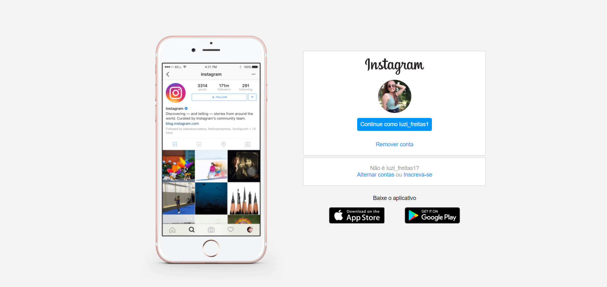
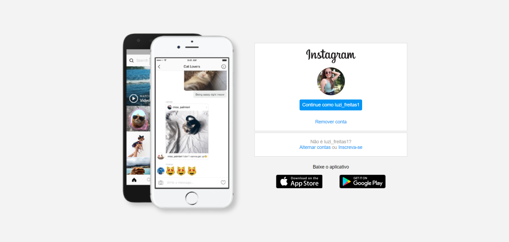

<h1 align="center"> 🚧 Instagram-Clone 🚧</h1> 

<h3 align="center"> 🚀 Bootcamp DIO 🚀 </h3> <br>

<p align="center"> Recriação da pagina inicial do Instagram utilizando flexbox, posicionamento de elementos em tela e responsividade. <p>

<h3> Versão inicial </h3>



<h3> Versão 2 </h3>



<h2>Features</h2>

- [x] Mudar ícone do celular
- [ ] Colocar rodapé
- [ ] Alterar entre thema dark e light
- [ ] Colocar animação na imagem do celular

<h2>Aprendizado</h2>

<p>Utilização da propriedade ```-webkit-filter``` para criar efeito de sombra na imagem png do celular</p>

